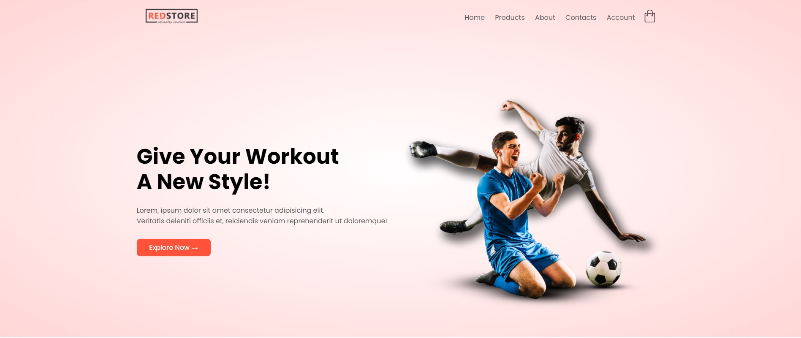
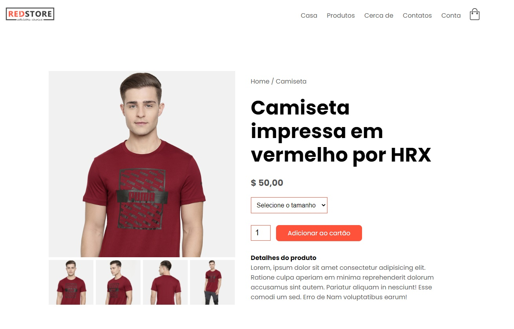
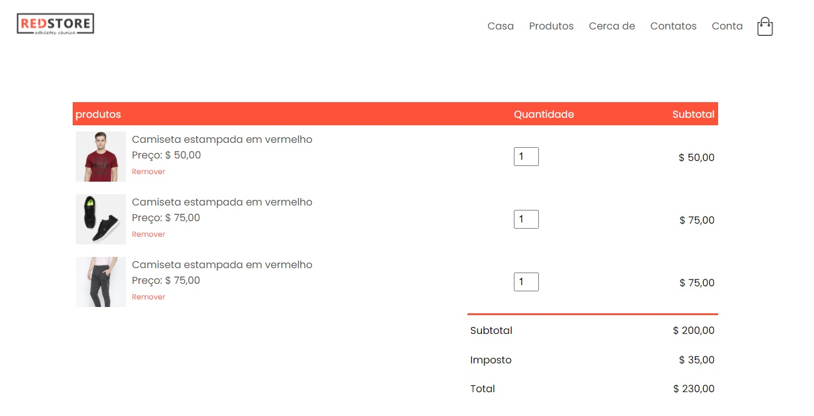

# Olá, devs 👋!	

Aqui estão algumas idéias sobre mim para você começar:

- 🌱 Atualmente estou estudando **(Javascript, ReactJS e TypeScript(*agendado*))**;
- 👯 Estou procurando colaborar no desenvolvimento social e projetos open-source;
- 🤔 Estou procurando ajuda para muitos projetos, tente entrar em contato comigo!:
- 💬 Me pergunte sobre qualquer coisa **[Paulo Pessoa](mailto:mrcerebro8@gmail.com)**.

	
## Projecto : REDSTORE - LOJA VIRTUAL (E-COMMERCE)

	
Fui desafiado por uma equipa a criar o frontend de uma Loja Virtual (E-commerce)

## Objectivo do desafio

Conhecer as minhas skills em desenvolvimento, uma vez que sempre desenvolvi tudo simplesmente por estudo
Hoje apresento-vos algo que poderá mudar a minha rotina no apreendizado, tanto em desenvolvimento web **(frontend)**, quanto em design **(UX/UI Design)**

## Dificuldades

Colocar no menu um **Drop-down**, estava listado nas tarefas a fazer, porém não consegui até ao fim ... ego (não quis pesquisar e perdi pontos na análise)

## Características do projecto

- Responsivo
- Simples
- Bonito
- Interativo (faltou alguns ajustes para isso)

## O quê que aprendeu

Desenvolver um projecto que poderá dar solução em determinado serviço.
Tudo sem frameworks nem bibliotecas, apenas as tecnologias: ***HTML***, ***CSS (Flexbox)*** e ***JS***

## Visualizar o projecto

[projecto-redstore.github.io](https://mr-cerebro.github.io/projecto-redstore/)

## Redes Sociais

- Behance: [Paulo Pessoa](https://www.behance.net/mr-cerebro)
- Dribble: [Paulo Pessoa](https://dribbble.com/mr-cerebro)
- Facebook: [Paulo Pessoa](https://www.facebook.com/paulo1pessoa)
- Instagram: [Paulo Pessoa](https://www.instagram.com/_mrcerebro/)
- Linkedin: [Paulo Pessoa](https://www.linkedin.com/in/paulo-pessoa-2777841b2/)
- Twitter: [Paulo Pessoa](https://twitter.com/PauloPe65041263)

# Hello devs 👋!

Here are some ideas about me to get you started:

- 🌱 I'm currently studying **(Javascript, ReactJS and TypeScript(*scheduled*))**;
- 👯 I'm looking to collaborate on social development and open-source projects;
- 🤔 I'm looking for help for many projects, try contacting me!:
- 💬 Ask me about anything **[Paulo Pessoa](mailto:mrcerebro8@gmail.com)**.

## Project: REDSTORE - VIRTUAL STORE (E-COMMERCE)

	
I was challenged by a team to create the frontend of a Virtual Store (E-commerce)

## Challenge objective

Knowing my skills in development, since I've always developed everything simply by studying
Today I present to you something that could change my routine in apprehended, both in web development **(frontend)**, and in design **(UX/UI Design)**

## Difficulties

Putting a **Drop-down** in the menu, it was listed in the tasks to do, but I couldn't make it to the end... ego (I didn't want to search and I lost points in the analysis)

## Project Features

- Responsive
- Simple
- Beautiful
- Interactive (missed some adjustments for that)

## what you learned

Develop a project that can provide a solution in a given service.
All without frameworks or libraries, just the technologies: ***HTML***, ***CSS (Flexbox)*** and ***JS***

## View the project

[projecto-redstore.github.io](https://mr-cerebro.github.io/projecto-redstore/)

## Social networks

- Behance: [Paulo Pessoa](https://www.behance.net/mr-cerebro)
- Dribble: [Paulo Pessoa](https://dribbble.com/mr-cerebro)
- Facebook: [Paulo Pessoa](https://www.facebook.com/paulo1pessoa)
- Instagram: [Paulo Pessoa](https://www.instagram.com/_mrcerebro/)
- Linkedin: [Paulo Pessoa](https://www.linkedin.com/in/paulo-pessoa-2777841b2/)
- Twitter: [Paulo Pessoa](https://twitter.com/PauloPe65041263)
